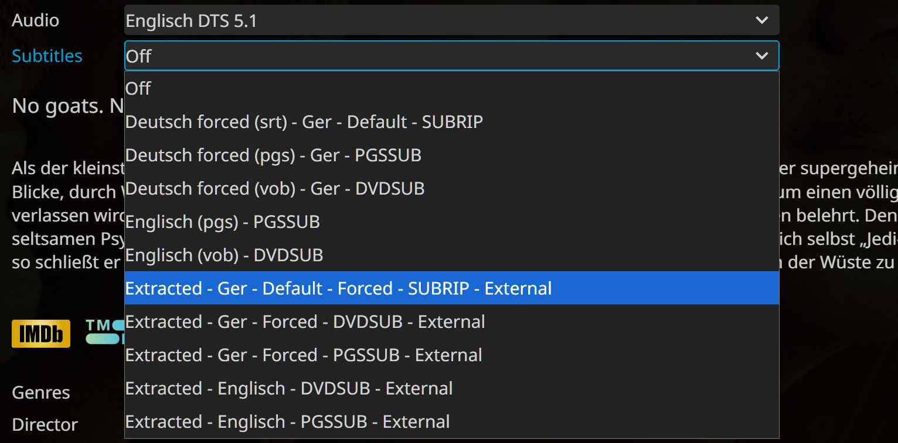

Thanks for the fixes & credits to [LiamKarlMitchell](https://github.com/LiamKarlMitchell)

---
MKV Subtitle Extractor – Jellyfin-Aware Naming

Tested on Windows 11, skript uses Python and MKVToolnix (both added to path in windows)

Overview:

The MKV Subtitle Extractor is a Python tool for extracting subtitles from .mkv files while preserving metadata in a Jellyfin-compatible way. Many MKVs contain multiple subtitle tracks with overlapping languages, flags, or properties. This tool handles text (.srt) and image (.sub/.idx, .sup) tracks and generates clear filenames reflecting language, default/forced flags, and hearing-impaired indicators. Ideal for libraries with container subtitles, manually collected subtitles (.External), and OpenSubtitles downloads. Consistent naming and custom tags allow coexistence without overwriting.

Design Philosophy:

The MKV Subtitle Extractor is a tool for managing subtitles in MKV files with the goal of ensuring that all tracks are correctly interpreted by Jellyfin and displayed in an organized and readable way. MKV files often contain multiple subtitle tracks that share languages, flags, or other properties, which can lead to confusion or misordering if subtitles are extracted or renamed arbitrarily. To address this, the tool enforces a strict filename convention that encodes key metadata in a specific order: the base filename, followed by optional default flag, language code, hearing-impaired or SDH indicators, forced track flag, a source identifier tag, and, if necessary, a counter for duplicate tracks.

The first step in the workflow is analyzing the MKV container with MKVMerge to generate JSON metadata. Each subtitle track is examined for its ID, codec, language, default and forced flags, and track name. Hearing-impaired or SDH tracks are detected using pattern matching in the track name. The extracted metadata is then normalized using a language mapping file to ensure consistent language codes. Tracks without language information are reported separately, as well as those that have three-letter ISO codes which weren'nt able to parse. It parse then the equal data as fallback.

After collecting metadata, filenames are generated according to the convention: (basename)[.default][.(lang)][.(hi)][.forced].Extracted[(counter)].(ext). The order of the components is critical. The base filename ensures the subtitle is associated with the correct video. The default flag appears first so Jellyfin can identify and select the main subtitle track automatically. The language code follows, allowing Jellyfin to parse ISO codes consistently. The optional HI/SDH flag comes next, maintaining visual association with the language. The forced flag signals that the subtitle should appear automatically in relevant scenes. The source identifier tag follows: .Extracted for container-extracted tracks, .External for manually collected tracks, and no tag or default naming for OpenSubtitles downloads. Finally, a counter is added if multiple tracks would otherwise have identical names, ensuring uniqueness.

The .Extracted tag identifies subtitles that have been extracted from the container. It allows these tracks to be distinguished from external or downloaded subtitles and ensures that Jellyfin displays them clearly. The counter appended to .Extracted is necessary when multiple tracks share the same language or flags and cannot otherwise be differentiated. This situation frequently occurs with Portuguese, which has variants for Portugal and Brazil, Spanish tracks with regional accents, or Chinese tracks where Simplified and Traditional versions exist. Since Jellyfin only parses standard ISO language codes, sublanguage distinctions are not recognized, making the counter the only reliable fallback.

Manually collected or previously archived subtitles are labeled with the .External tag. This tag is capitalized deliberately because Jellyfin does not parse custom flags but instead displays them exactly as written in the UI. Only one custom flag is allowed per file. Using .External allows users to maintain curated subtitles separately from container-extracted tracks or OpenSubtitles downloads, preventing accidental overwrites and keeping the library organized.

Subtitles obtained via OpenSubtitles are usually saved directly in the media folder, without any tag or flag (=no tag/default naming). They can overwrite existing files if not managed carefully. By combining .Extracted for container tracks, .External for curated external tracks, and OpenSubtitles (=no tag/default naming) downloads, all three “worlds” of subtitles can coexist in the same folder. Each source remains distinguishable, and the filenames reflect origin, language, flags, and any necessary counters. Internal or already embedded tracks remain the base layer and can be left untouched unless extraction is required.

This approach ensures that the order of tracks in Jellyfin is consistent and meaningful. Default tracks appear first, followed by tracks in other languages, HI/SDH tracks, and forced tracks. Counters resolve duplicates, and the filename tags make it possible to visually distinguish container-extracted, external, and OpenSubtitles (=no tag/default naming) subtitles. The system maintains clarity, avoids overwriting, and provides a reproducible method for organizing subtitles, even in large libraries with complex multilingual content.

Following this workflow and naming convention ensures that all subtitle sources can coexist, remain organized, and be displayed correctly in Jellyfin, while users retain control over which tracks are used, which are prioritized, and how duplicates are handled. The deterministic structure, clear tagging, and strict ordering of flags provide a consistent and reliable method for managing subtitles in complex multilingual libraries.

Naming Convention & Filename structure:

(basename)[.default][.(lang)][.(hi)][.forced].Extracted[(counter)].(ext)

Components:
- (basename): Video filename without .mkv
- [.default]: Track is flagged as default
- [.(lang)]: Normalized language code from mapping.txt -> Convert all ISO 639-2 codes, including alternatives and legacy variants, to ISO 639-1, because Jellyfin parses those most reliably. Not all of them will be parsed, but they will at least be recognized as a language and shown in the correct tag column. Although this has been widely discussed and requested, Jellyfin does not support language parsing for sublanguages defined in BCP 47, which is common for Portuguese (e.g., pt-br, Portuguese-Brazilian, ... en-us, en-uk, de-at), Spanish, and Chinese. Since this is not possible, we have to work with a counter (from the file Track ID upwards on naming collisions).
- [.(hi)]: Hearing-impaired / HI / SDH / CC
- [.forced]: Forced subtitle track
- .Extracted: Container-extracted tag (erase from code when not needed. Personal use see Design Philosophy; also use "*.External" for original external Scene Release subtitles and "empty" (=no tag/default naming) on OpenSubtitles with Addon)
- [(counter)]: Optional counter for indistinguishable tracks
- (ext): File extension based on codec (.srt, .sub/.idx, .sup)

Key Notes:
- .Extracted[(counter)] improves Jellyfin UI readability over numeric-only counters.
- Counters appear only for tracks that cannot be distinguished by Jellyfin.
- Prevents overwriting of previously collected subtitles.

Parsing & Workflow:
1. Track Analysis:
   - mkvmerge -J extracts JSON metadata.
   - Captures per-track info: ID, language, name, codec, default/forced flags.
   - Detects HI/SDH using regex on track names.
   - Determines track type: text or image.
2. Language Mapping & Normalization:
   - Uses mapping.txt to normalize language codes.
   - Undefined or "und" codes marked as None.
3. Filename Assignment & Collision Handling:
   - Generates filenames per convention.
   - Checks duplicates; adds counter as needed.
   - Default tracks prioritized in collisions.
   - Image tracks produce .sup, .sub/.idx pairs, text tracks .srt.
4. Simulation / Extraction:
   - Simulation: Prints filenames for review.
   - Extraction: mkvextract writes files to disk.
5. Post-run reporting:
   - Tracks with missing language codes. (no (lang) value created on this subtitles, just for Review bad metadata .mkv files) - #about 1%, 25 out of 2500 were complete faulty on testing#
   - left Tracks with not parseble 3-letter codes (for Review bad metadata .mkv files, not parseable from mappings.txt, the value is transferred 1:1 as a fallback) - #i had 2 matches out of 2500 on testing#
   - Summary of text vs. image tracks.

Counter Logic:
- Applied when multiple tracks share the same (lang), flags, or codec or simple no data.
- Common in pt/pt-br, Spanish with accents, Chinese variants.
- Deterministic based on track ID.
- Ensures uniqueness in Jellyfin even when sublanguage distinctions cannot be parsed.

Usage:
1. Install MKVToolNix and Python 3; ensure both are in system PATH.
2. Create a project folder and put the MKVSubExtractJellyParse.py in there.
3. In the same folder put the mapping.txt (language normalization) and paths.txt (one folderpath per line, recursive).
4. Run: python MKVSubExtractJellyParse.py (with console or by double click with a .bat shortcut)
5. Select subtitle filter: All / Text (.srt) / Image (.sub/.idx, .sup)
6. Select mode: Simulate / Extract
7. Review simulation output (+ Post-run reporting) before extraction.
8. Adjust the code behave to your needs (with AI also simple for beginners) and/or make a comment or code commit helping bug fixing.

Example Filenames (some combinations):

Text Tracks:
- Movie.default.en.Extracted.srt            → Default English
- Movie.en.Extracted.srt                     → English
- Movie.en.cc.Extracted.srt                 → English, HI/CC
- Movie.en.forced.Extracted.srt              → English, Forced
- Movie.forced.Extracted.srt                 → no language Data, Forced
- Movie.default.en.hi.Extracted.srt         → Default, English, HI/HI
- Movie.default.en.forced.Extracted.srt      → Default, English, Forced
- Movie.default.forced.Extracted.srt         → Default, no langauge Data, Forced (this and similar variants can happen even if it makes no sense, but we go strictly to convention & all metadata we get from the .mkv Track ID's)
- Movie.pt.Extracted.srt                     → Portuguese (first ID Track)
- Movie.pt.Extracted1.srt                    → Duplicate Portuguese (next ID Track)
- Movie.es.Extracted.srt                     → Spanish (first ID Track)
- Movie.es.Extracted1.srt                    → Duplicate Spanish (next ID Track)
- Movie.Extracted.srt                        → no Data at all
- Movie.Extracted1.srt                        → no Data at all, mutliple Tracks (worst case scenario)

Image Tracks:
- Movie.en.Extracted.sub/.idx                → English VOBSUB
- Movie.pt.Extracted.sub/.idx                → Portuguese VOBSUB
- Movie.en.sdh.Extracted.sup                 → English PGS, HI/SDH
- Movie.default.en.forced.Extracted.sup      → Default + Forced English PGS

(Even though it’s not excluded in the code, a file has never been tagged with both [hi] and [forced] at the same time on testing)

Subtitles from Other Sources:
- Movie.en.sdh.External.sup                 → .External Tag / Original Subtitle from Release Group or other external Source
- Movie.de.cc.External.srt                  → .External Tag / Original Subtitle from Release Group or other external Source
- Movie.default.en.forced.srt               → no Tag / VANILLA NAMING / base naming without Tag interacting with Subtitle Addons
- Movie.de.forced.sub/.idx                  → no Tag / VANILLA NAMING / base naming without Tag interacting with Subtitle Addons

License:
MIT
